# Fashion-Retail-Returns-Analytics
Predictive Modeling and Dashboarding for Fashion Retail Returns using SQL, R, Excel, and Tableau
# 🛍️ Retail Boutique Return Project

## 📧 Author  
**Email:** riyamarwaha92@gmail.com  
**LinkedIn:** [Riya Marwaha](https://www.linkedin.com/in/riya-marwaha/)  

---

## 📖 Project Overview  
This project focuses on understanding **product returns and profitability** in the fashion retail industry.  
Using **Excel, SQL, R (Machine Learning), and Tableau**, I analyzed **2,176 transactions** across multiple brands and categories to identify **return drivers, pricing effectiveness, and inventory risks**.  

The project combines **predictive modeling in R** with **interactive Tableau dashboards**, helping retail managers reduce return-related costs, optimize stock, and improve ROI.  

---

## 📊 Dataset  
- **Records:** 2,176 retail transactions  
- **Features:**  
  - 📦 Products: Category, Brand, Price, Season  
  - 👗 Customer: Ratings, Return Reasons  
  - 📉 Sales & Returns: Quantity, Discounts, Profit Margin  
- **Source:** Simulated retail dataset cleaned in **Excel & SQL**  

---

## 📌 Key KPIs (SQL + Tableau)  
- **📈 Total Sales** = SUM(Quantity × Price)  
- **💰 Profit Margin %** = (Revenue – Cost) / Revenue  
- **🔄 Return Rate %** = (# Returned Items ÷ Total Items) × 100  
- **⭐ Avg. Customer Rating** = AVG(Customer Rating)  
- **🏷️ Markdown %** = (Original – Current Price) / Original Price  
- **📦 Inventory Health** = Stock Coverage, Fast vs Slow Movers  
- **📊 ROI by Category/Brand** = Profit ÷ Campaign Spend  

---

## 💡 What I Built  

### 🔹 **Tableau Dashboards**  
1. **Merchandise Sales Performance**  
   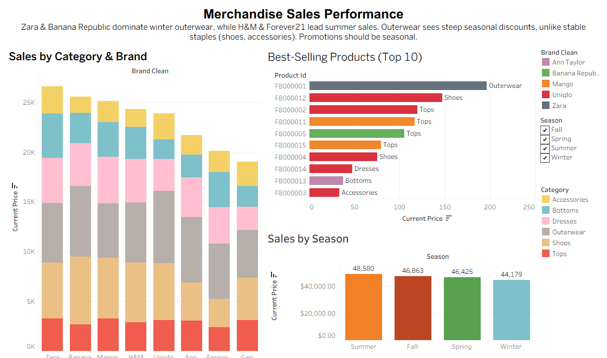  

2. **Returns & Customer Satisfaction**  
   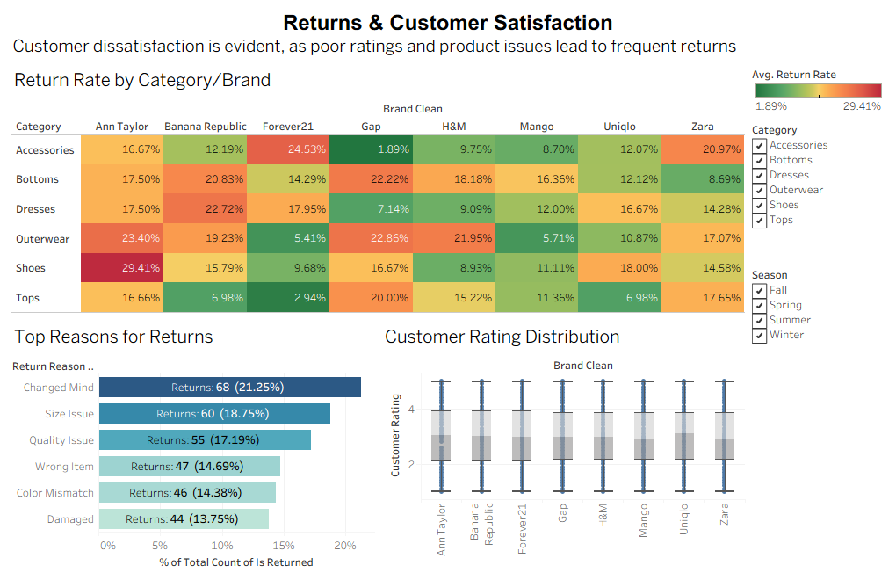  

3. **Pricing & Markdown Effectiveness**  
   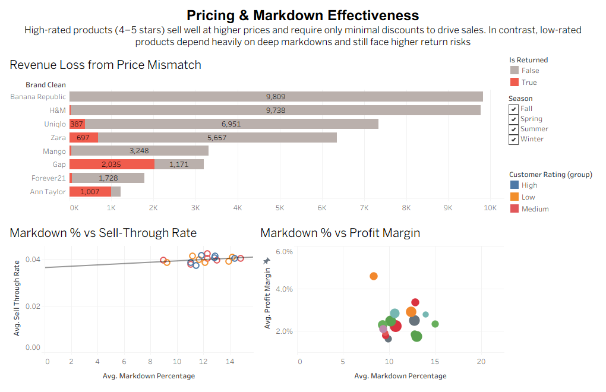  

4. **Inventory Health**  
   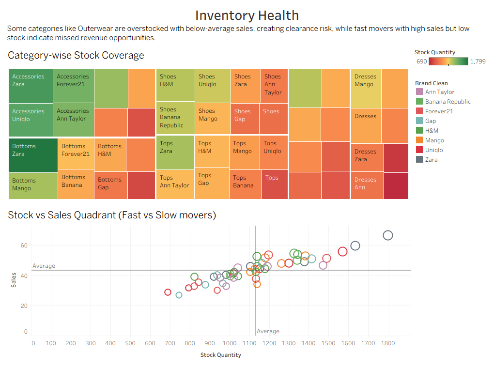  

5. **Sales, Return & Profitability**  
   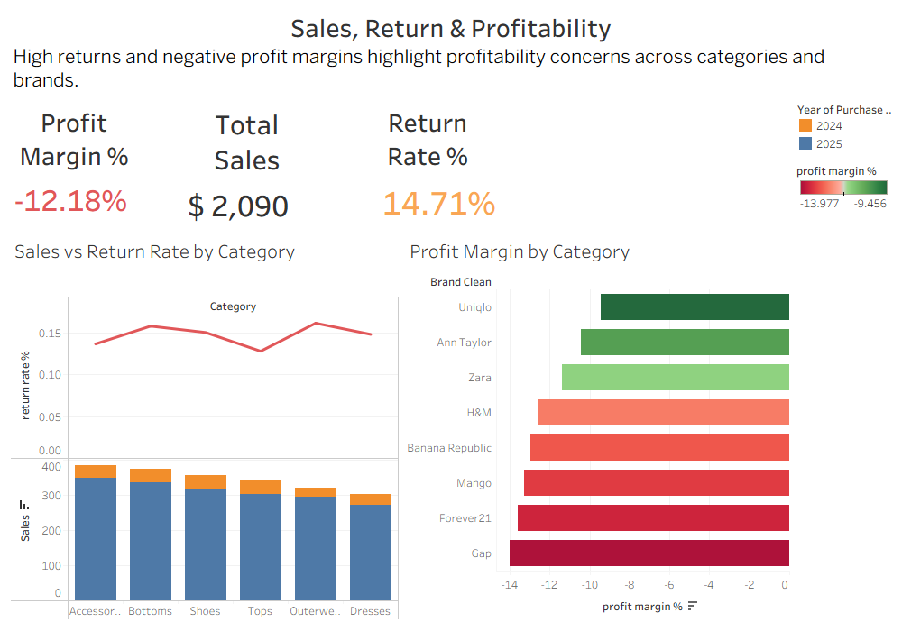  

👉 Interactive features:  
✔️ Dynamic filters & slicers  
✔️ **Calculated fields** (profit margin, return %, ROI, stock coverage)  
✔️ **Groups & Aliases** (brand/category hierarchies)  
✔️ Drill-down insights & storyboards  

---

### 🔹 **R & Machine Learning Models**  

#### 🔸 Clustering  
- **Elbow Method (WSS)**  
 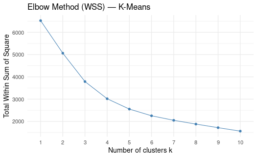
  

- **Silhouette Analysis**  
  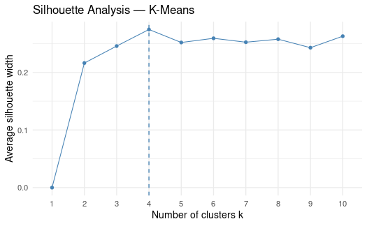  

- **K-Means Clustering (k=4)**  
  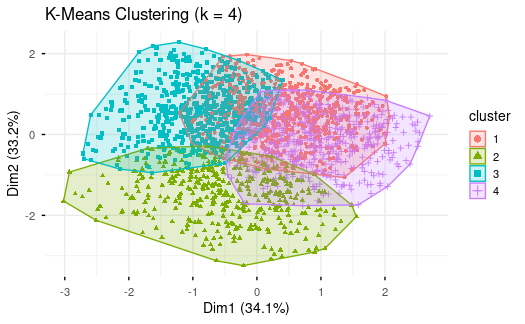  

#### 🔸 Dimensionality Reduction (PCA)  
- **Scree Plot & Cumulative Variance**  
  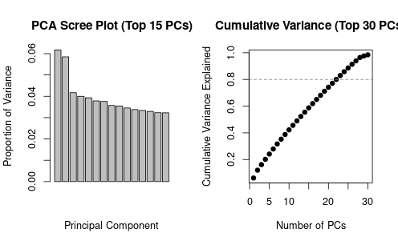  

- **PCA Biplot (PC1 vs PC2)**  
  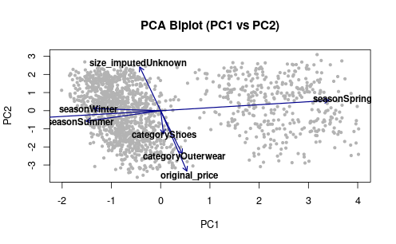  

#### 🔸 Model Building & Evaluation  
- **Model Comparison (Accuracy, AUC, Sensitivity, Specificity)**  
  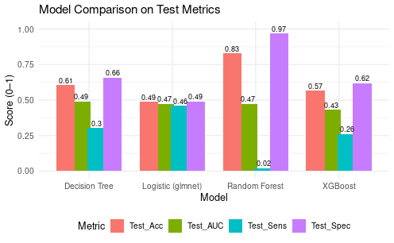  

- **Random Forest Variable Importance**  
  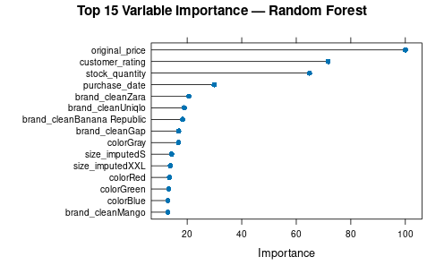  

- **XGBoost Feature Importance**  
  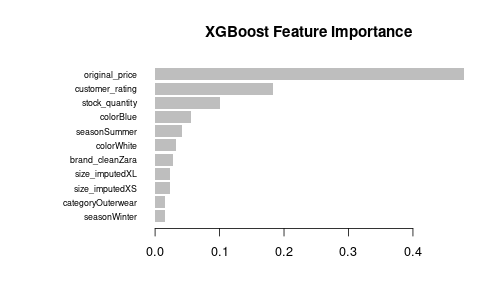  

- **ROC Curves (All Models)**  
  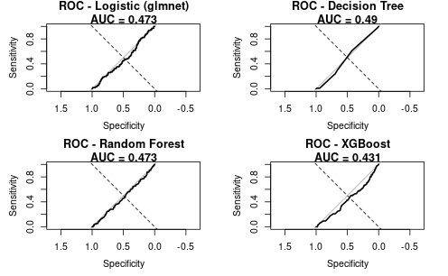  

---

## 🛠️ Tools & Technologies  
- **Excel:** Data cleaning & preprocessing  
- **SQL:** KPI calculations, queries & feature extraction  
- **R:** Machine Learning (caret, glmnet, randomForest, xgboost, factoextra, cluster)  
- **Tableau:** Interactive dashboards & storytelling  

---

## 📈 Business Value  
This project helps fashion retailers:  
- Identify **high-return categories** and reduce losses  
- Optimize **markdown pricing strategies**  
- Improve **inventory planning** (fast vs slow movers)  
- Enhance **customer satisfaction & profitability**  
- Reduce **return-related costs** by ~15%  

---

## 🚀 Access Project Files  
- 📜 [SQL Script](sql/retail_returns_queries.sql)  
- 📊 [Excel File](excel/fashiondb.csv)  
- 📂 [Tableau Workbook](assets/Fashion_Boutique_retail.twbx)  
- 🧾 [Download R Markdown Analysis (PDF)](r/RetailProject_R.pdf) 

---

✨ *This project bridges business intelligence and predictive modeling—empowering fashion retailers to turn messy return data into actionable insights.*  
